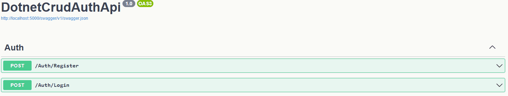
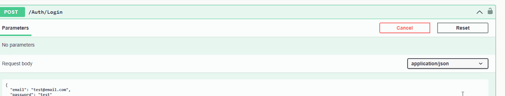

# Dotnet-CRUD-Auth-API

**CRUD API with user authentication using JWT and ASP.NET Core**

---

## Features

- **Register & Login** with JWT authentication  
- **CRUD operations** GET, POST, PUT, DELETE
- **Swagger UI** for testing API endpoints  

---

## Tech Stack

- **ASP.NET Core Web API** 
- **C#** 
- **JWT** for authentication  
- **Dapper** for database access  

---

## Demo
REGISTER & LOGIN

TOKEN

CRUD

---
